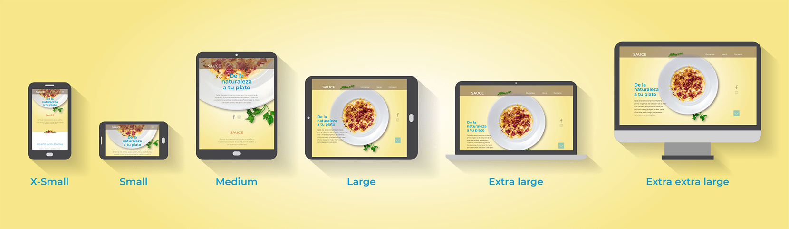

# Mi primer sitio: [Sauce | Restaurante de Tradición][index-page]

Este es un proyecto realizado en el transcurso del año 2021, en el cual comencé a dar mis primeros pasos en el mundo del desarrollo web. El objetivo principal de este trabajo fue aplicar y llevar a la práctica los conceptos principales que fui aprendiendo desde cero en cuanto a lenguajes de marcado, estilos y conceptos centrales correspondientes a la extensa teoría que existe alrededor del desarrollo web.

Es un sitio estático debido a que aún no comencé a estudiar JavaScript, dado que consideré y me propuse como objetivo principal estudiar, aprender y entender de la forma más consistente posible las bases de HTML, CSS, Sass y gran parte de los conceptos y buenas prácticas que, a día de hoy, se llevan a cabo a la hora de utilizar estas tecnologías. Una vez cumplidos estos objetivos básicos, los cuales se plasman en este proyecto, me adentraré definitivamente en el aprendizaje del anteriormente mencionado JavaScript y así dar un paso más en mi camino a convertirme en un desarrollador Front-end.

Como podrás ver al [visitarlo][index-page], la idea principal es la de un restaurante ficticio dedicado a la comida tradicional, orgánica y de estación. Teniendo en cuenta que no poseía conocimiento alguno de HTML y CSS, representó un gran desafío poder resolverlo y así aprender en el proceso cada parte de la teoría que iba estudiando y que obligatoriamente necesitaba llevar a la práctica para poder incorporarla definitivamente. A continuación voy a explicar diferentes partes del desarrollo del proyecto para que al momento de explorar el repositorio puedas entender un poco mejor su estructura, el código y las decisiones tomadas a lo largo del proceso.

## Índice de contenidos
+ [Estructura](#estructura)
    + [Index](#index)
    + [Menú](#menú)
    + [Platos](#platos)
+ [*Mockups*](#mockups)
+ [Metodología BEM](#metodología-bem)
+ [*Mobile first + Responsive design*](#mobile-first--responsive-design)
+ [Optimización de imágenes](#optimización-de-imágenes)
    + [Formatos de próxima generación](#formatos-de-próxima-generación)
    + [Elementos \<picture> y \<source>](#elementos-picture-y-source)
+ [*Bootstrap*](#bootstrap)
+ [Sass](#sass)
    + [Directorios y sus contenidos](#directorios-y-sus-contenidos) 
    + [Reflexión final sobre Sass](#reflexión-final-sobre-sass) 
    

## Estructura

Es un sitio formado por un total de 12 secciones, en las cuales se destacan el [index][index], el [menú][menu] y las diferentes opciones de platos que ofrece el restaurante. Además, cuenta con una página de [contacto][contacto] a la que se puede ingresar desde todas las demás páginas del sitio, excepto desde el [index][index], el cual posee su propia sección en la que ofrece un formulario de [contacto][contacto-index] para que el usuario pueda realizar su consulta. 

> En la imagen se grafican las secciones principales presentes en el sitio y el flujo de navegación que se brinda para que el usuario pueda llegar a visualizar sus platos favoritos.


+ ### [Index][index]
    Es la página principal en la cual se presenta el restaurante y se invita al usuario a visitar el [menú][menu]. Además, se facilita un formulario de [contacto][contacto-index] para que pueda realizar su consulta y dos enlaces hacia sitios web externos correspondientes a sus redes sociales.

+ ### [Menú][menu]
    Es la página en la cual se presentan los 9 platos disponibles en la carta del restaurante, con sus correspondientes enlaces para visitarlos. Además, se presenta un enlace hacia la página de [inicio][index] por si el usuario desea volver a ella y otro hacia la página donde se facilita un formulario de [contacto][contacto] para que pueda realizar su consulta.
    
+ ### Platos
    Estas páginas pertenecen a los platos que el restaurante ofrece a su público. Ellos son: 
    * [Ensalada Tabulé][ensalada-tabule]
    * [Pechugas con ensalada][pechugas-con-ensalada]
    * [Pollo frito con vegetales][pollo-frito-con-vegetales]
    * [Arroz con camarones][arroz-con-camarones]
    * [Chow Mein][chow-mein]
    * [Pollo al curry con arroz][pollo-al-curry-con-arroz]
    * [Mostacholes con salsa][mostacholes-con-salsa]
    * [Ravioles negros][ravioles-negros]
    * [Tirabuzones con brócoli][tirabuzones-con-brocoli].
      
    Se los presenta con una breve descripción y su precio, dándole la opción al usuario de realizar un pedido vía delivery (aunque mediante un botón sin funcionalidad alguna). Además, estas páginas presentan una sección de información nutricional en donde se exponen las calorías totales y un desglose que muestra las calorías que representan en cada plato las grasas, carbohidratos y proteínas; esta información es acompañada por una breve descripción de cada una de ellas.
    
    Cada página «plato» cuenta con un enlace hacia los dos platos más próximos dentro del proyecto, pudiendo acceder a ellos sin la necesidad de volver a visitar la página del [menú][menu]. Aunque si así lo deseara, el usuario también cuenta con enlaces hacia él, la página de [inicio][index] y hacia la página con el formulario de [contacto][contacto] para que pueda realizar su consulta.
    
    
    ## *Mockups*
    
    En la raíz de este repositorio se encuentra la carpeta llamada [mockups/][mockups] en la que se pueden visualizar en formato PDF y ordenados según el tamaño de dispositivo para los cuales fueron diseñados, los mockups de todas las páginas que conforman el diseño de este sitio, realizados en Adobe XD.
    
    Haber podido organizar el trabajo de esta manera, en la que primero diseñé las piezas a plasmar a lo largo de todos los documentos del sitio, me permitió diferenciar ambas etapas, la de diseño y desarrollo, de una mejor forma. Esto hizo que pueda concentrarme mucho mejor en el desarrollo del código cuando llegó el momento debido a que la primera parte correspondiente al planteo y presentación del contenido ya estaba en su gran mayoría resuelta, aunque en varias ocasiones me veía obligado a cambiar ciertas decisiones dado que al momento de querer pasar a código algún contenido diseñado con anterioridad me topaba con que no era posible presentarlo de esa manera o que era demasiado complejo para esta etapa en la cual estoy aprendiendo y dando mis primeros pasos. 
    
    El resultado final de esas iteraciones son los diseños finalizados y posteriormente estructurados a través de los documentos HTML que podés explorar por medio de esta [carpeta][mockups] o bien [visitando][index-page] el sitio.
    
    
    > Captura de pantalla general de las mesas de trabajo de Adobe XD en la que se puede ver a cada sección del proyecto con sus respectivas vistas diseñadas
    
    
    
    > Captura de pantalla del Index en la se pueden ver las 12 columnas utilizadas para disponer a lo largo del diseño cada elemento en su lugar
    
    
    
    > Captura de pantalla del Menú en la se pueden ver tres diseños correspondientes a tres vistas diferentes
    
    
    
    > Captura de pantalla del Plato 1 en la que se puede ver la disposición de los contenidos regida por las 12 columnas que son utilizadas a lo largo de todo el proyecto
    
    
    

    ## Metodología BEM
    
    Con el objetivo de poder simplificar el CSS/Sass y conseguir un estilo consistente, al mismo tiempo que el código fuese mucho más legible y fácil de mantener, opté por adoptar la metodología [BEM (*Block Element Modifier*)][BEM], que me ayudó a generar una estructura coherente a través de los distintos documentos del sitio. Esto me permitió trabajar más rápidamente y de una manera más eficiente de que si, intuyo, no la hubiese aplicado.
    
    Particularmente considero que es una metodología muy potente. Al implementarla me sentí muy cómodo ya que me obligó a generar nomenclaturas mucho más estrictas y conectadas entre sí. Como mencioné en el párrafo anterior, este objetivo se me hubiese hecho muy cuesta arriba de no haberla utilizado. Claramente este es un proyecto pequeño y solo desarrollado por mí, pero entiendo que puede ser una forma muy beneficiosa de trabajar, más cuando se forma parte de un equipo de trabajo en el cual cada miembro tenga una manera distinta de escribir código. Es por esto que considero que en mis futuros desarrollos seguiré implementando esta metodología para seguir familiarizándome con ella y así poder sacarle todo el provecho posible, logrando una manera de trabajar más beneficiosa tanto para mí como para a quien le toque estar frente a mi código.
    
    A continuación se pueden visualizar algunos fragmentos de código en los cuales se puede ver esta metodología aplicada a la nomenclatura de las clases, generando bloques, elementos y modificadores que me permitieron manipular cada componente de una manera más efectiva y estructurada.
    
    
    > `<header>` perteneciente al Index
    ```html
    <header class="header header--brown">
        <nav class="header__nav">			

            <a class="header__brand" href="#start-index">SAUCE</a>

            <button class="header__toggler">
                <span class="header__toggler-icon"></span>
            </button>

            <div class="header__navbar" id="navbar-index">
                <ul>
                    <li class="header__item">
                        <a class="header__link" href="#start-sauce">Comenzar</a>
                    </li>

                    <li class="header__item">
                        <a class="header__link" href="./pages/menu.html">Menú</a>
                    </li>

                    <li class="header__item">
                        <a class="header__link" href="#contact-index">Contacto</a>
                    </li>
                </ul>
             </div>

        </nav>
    </header>
    ```
    
    
    > Fragmento del 'title-section' perteneciente al Index
    ```html
    <section class="title-section">
        <article class="title-section__article title-section__article--index">
            <h1 class="title-section__title title-section__title--index">
                De la <br>naturaleza <br>a tu plato
            </h1>
            <p class="title-section__parrafo title-section__parrafo--index">
                Cada día seleccionamos materia prima orgánica de estación de la más alta calidad, 
                apoyando a nuestros productores y granjas locales, para ofrecerte así lo mejor 
                de nuestra naturaleza en cada plato.
            </p>
        </article>
    </section>
    ```


    > Fragmento de la 'principal-section' perteneciente al Menú
    ```html
    <section class="principal-section" id="start-cards">
        <div class="principal-section__cards">

            <article class="principal-section__card principal-section__card--plato-1">

                <picture class="principal-section__card__picture">

                    <source srcset="../media/menu/card-image-1.webp" type="image/webp">
                    

                </picture>

                <h2 class="principal-section__card__title">Ensalada Tabulé</h2>
                <p class="principal-section__card__price">$&#8239;300</p>
                <a class="principal-section__card__link" href="./plato-1.html">VER</a>

            </article>
        </div>
    </section>
    ```  
    
    ## *Mobile first + Responsive design*
    
    
    
    En el proceso de investigación y estudio me encontré con estos dos conceptos centrales en el campo del desarrollo web actual. 
    
    Así es que para este primer proyecto decidí adoptar este flujo de trabajo denominado *mobile first*. Para quien no esté familiarizado con él, es una metodología que se basa en desarrollar el código en primer lugar para los dispositivos más pequeños que los usuarios probablemente tengan, como *smartphones* o tabletas. Implica trabajar en el desarrollo integral de un *software* a partir de la concepción *mobile*, para luego ir introduciendo modificaciones a medida que los tamaños de dispositivos aumentan, hasta llegar a una versión de escritorio. Acá entra en juego el segundo concepto conocido como *responsive design*, que se refiere a la idea de que un sitio web debe mostrarse igual de bien en todo tipo de dispositivo, desde monitores de pantalla panorámica hasta teléfonos móviles, logrando este objetivo mediante el uso de *media queries* de CSS.
    
    Un gran aliado a la hora de poder comprender más a fondo sus aplicaciones y, efectivamente, poder llevarlas a cabo, fue el *framework* [*Bootstrap*][bootstrap]. Con sus herramientas de *layout* correspondientes a los *breakpoints* y su sistema de grillas, me permitió poder desarrollar el sitio de forma predeterminada para los dispositivos más pequeños y luego poder ir agregando capas de estilos que irían ajustando y personalizando con más precisión el diseño y contenido acorde a las ventanas gráficas o dispositivos más grandes en los que pudiese ser renderizado.
    
    A continuación se detalla la tabla de *breakpoints* bajo los cuales fue diseñado y desarrollado íntegramente el proyecto, pertenecientes a la versión [5.1 de *Bootstrap*][bkp-bootstrap].
    
    | Breakpoint  | Prefijo de clase  | Dimensiones de dispositivo |
    | ------------ |---------------| -----|
    | X-Small      | No tiene (predeterminado) | <576px |
    | Small      | sm | ≥576px |
    | Medium      | md | ≥768px |
    | Large      | lg | ≥992px |
    | Extra large      | xl | ≥1200px |
    | Extra extra large      | xxl | ≥1400px |
        
     ## Optimización de imágenes
     Debido a que las imágenes constituyen un porcentaje considerable en el peso total de una página web, me dispuse a optimizarlas para poder lograr un mejor rendimiento del sitio. 
     
     En este proceso de desarrollo aprendí que los beneficios de lograr una buena optimización en las imágenes son múltiples, ya que, en primer lugar, mejorarán la velocidad de carga de las páginas. Esto, a su vez, mejorará el SEO (*Search Engine Optimization*) ya que hará que los sitios clasifiquen más alto en los resultados de los motores de búsqueda debido a que los archivos más pequeños lograrán agilizarlo frente a otros sitios que, quizás, no aborden estas optimizaciones. Además, se puede deducir que estos archivos utilizarán un menor ancho de banda y requerirán también un menor espacio de almacenamiento en el servidor.
     
     Llegado a este punto, el objetivo principal debe ser encontrar un equilibrio entre un tamaño de archivo menor y una calidad gráfica aceptable. 
     
     ### Formatos de próxima generación
     En este estudio e investigación sobre optimización de imágenes fue que conocí el formato ['webp'][webp]. Con él, las imágenes se comprimen mejor que en los formatos 'png' o 'jpg', lo que hace que se descarguen más rápido y consuman menos datos. Esto lo convierte en un formato ideal para la web ya que puede crear imágenes más pequeñas pero sin prescindir de su calidad. 
     
     Ahora bien, a pesar de que es soportado por casi todas las últimas versiones de los navegadores web ([Can I use][can-i-use-webp]), es necesario tener en cuenta que no todos los usuarios podrían llegar a tener estas últimas versiones en sus dispositivos. Por lo tanto, lo correcto es usar un método que pueda cubrir a todos los usuarios, es decir, que entregue a la totalidad de ellos imágenes en el formato que sus navegadores puedan soportar.
     
     ### Elementos `<picture>` y `<source>`
     El elemento `<picture>` me permitió incluir imágenes definiendo más de una fuente. Si el navegador del usuario que [visitie el sitio][index-page] admite 'webp', descargará la versión 'webp' del archivo de imagen en lugar del 'png' por defecto, lo que hará que la página se descargue más rápido.
     
     > Fragmento perteneciente al Index
   ```html
   <picture>

      <source srcset="./media/index/lg/main-image-2.webp" type="image/webp">
      

   </picture>
   ```
   
     Como se puede ver en el ejemplo de arriba, el elemento `<picture>` funciona como un contenedor de elementos `<source>` e `` que apuntan a archivos particulares. Si se usa `<source>` para apuntar a una imagen 'webp', el navegador verá si puede manejarla; de lo contrario, recurrirá al archivo de imagen especificado en el atributo 'src' del elemento ``.
     
     > Fragmento perteneciente al Plato 1
     ```html
     <picture>

        <source media="(min-width: 1200px)" srcset="../media/plato-1/xl/hero-image.webp" type="image/webp">
        <source media="(min-width: 1200px)" srcset="../media/plato-1/xl/hero-image.png">

        <source media="(min-width: 768px)" srcset="../media/plato-1/md/hero-image.webp" type="image/webp">
        <source media="(min-width: 768px)" srcset="../media/plato-1/md/hero-image.png">

        <source srcset="../media/plato-1/hero-image.webp" type="image/webp">
        

     </picture>
     ```
     En este último ejemplo de arriba también se puede ver cómo utilicé otra de las funcionalidades que ofrece el atributo 'media' del elemento `<source>`. Así, no solo pude optimizar las imágenes para distintos formatos según el soporte del navegador que el usuario esté utilizando, sino que también esta optimización se puede dar en cuanto al ancho del dispositivo en el cual ese navegador esté renderizando el sitio. Primero utilizará las sugerencias pasadas en los valores de los atributos 'media' para cargar el recurso de imagen más apropiado de acuerdo al tamaño del dispositivo y, luego, hará lo mismo con el atributo 'srcset' y su formato.
    
    ## [*Bootstrap*][bootstrap]
    
    Como mencioné en el apartado de [*Mobile first + Responsive design*](#mobile-first--responsive-design), me valí de este *framework* para poder aplicar ciertas herramientas que me permitieron simplificar el proceso de maquetación, sirviéndome de guía para poder desarrollar un sitio completamente *responsive*. 
    
    Si bien mi objetivo al implementarlo fue poder adentrarme en una tecnología de este tipo, es decir, familiarizarme con el trabajo de acuerdo a una metodología y utilizar determinados patrones, procuré aplicar solo lo estrictamente necesario (principalmente el [sistema de grillas][grid-system] junto con algún que otro componente, como puede ser el [*navbar*][navbar] del `<header>`, el [*accordion*][accordion] de la 'info-nutricional' y ciertas clases utilitarias) ya que al ser mi primer desarrollo y al estar aprendiendo e intentando entender CSS desde la base, creí necesario que los estilos y el diseño general del proyecto fuesen totalmente personalizados. 
    
    Considero que de haberme valido solamente de los estilos predeterminados que ofrece *Bootstrap* no hubiese podido lograr afianzar ciertos conceptos necesarios a la hora de tener una buena base en CSS. Esto se debe a que pude experimentar con una infinidad de reglas personalizadas en cuyo proceso constante de prueba y error presente a lo largo de todo el desarrollo del proyecto tuve la oportunidad de incorporar de forma más consistente cada aspecto estudiado. Seguramente no faltará oportunidad en la cual pueda trabajar más a fondo con este y con algún otro *framework* CSS para poder conocerlos con mucho más detalle y así maximizar sus beneficios al aplicarlos. Por el momento creo que pude mantener cierto equilibrio en cuanto a la necesidad de experimentar con CSS puro e implementar por primera vez una herramienta como *Bootstrap*.
    
    A continuación ejemplificaré dos casos de uso dentro del proyecto para hacer un poco más visible lo mencionado con anterioridad. Es muy importante recordar y tener en cuenta que estas clases están acompañadas de una personalización que se llevó a cabo mediante el archivo [main.css][css-custom] (aunque manipulado a través de [Sass][sass-dir]). Así que para poder entender el resultado del renderizado al que se llega en cualquier *breakpoint*, lo ideal es revisar tanto el código HTML con sus clases de *Bootstrap* como así también el CSS personalizado (o el Sass, lo que te sea más cómodo), ya que ambos trabajan en conjunto para llegar a él.
    
    ### `<header>` maquetado con sistema de grillas y un *navbar component*

    ```html
    <!-- Genero el contenedor principal -->
    <header class="header header--brown container-fluid">
        <!-- Genero el envoltorio de las columnas -->
        <div class="row g-0">
            <!-- Genero la columna principal y doy inicio al componente 'navbar' de Bootstrap indicándole que deberá
            expandirse a partir del breakpoint 'large' con la clase 'navbar-expand-lg' -->
            <nav class="col header__nav navbar navbar-dark navbar-expand-lg align-items-stretch p-0">

                <a class="header__brand" href="#start-index">SAUCE</a>

                <!-- Genero el 'navbar-toggler' que mediante JavaScript funcionará como activador del 'navbar-collapse'
                mientras esté colapsado en los breakpoints por debajo del tamaño 'large' -->
                <button class="header__toggler navbar-toggler" type="button" data-bs-toggle="collapse" data-bs-target="#navbar-index" aria-controls="navbar-index" aria-expanded="false" aria-label="Toggle navigation">
                    <span class="header__toggler-icon navbar-toggler-icon"></span>
                </button>

                <!-- Genero el 'navbar-collapse' que permanecerá oculto mientras el sitio sea renderizado por 
                debajo del breakpoint 'large' y que será visibile gracias a la activación del 'navbar-toggler' -->
                <div class="header__navbar navbar-collapse collapse" id="navbar-index">
                    <!-- Genero el 'navbar-nav' que será el envoltorio de los ítems principales de la navegación -->
                    <ul class="navbar-nav flex-sm-row">

                        <!-- Genero el 'nav-item' que será el elemento principal de la navegación -->
                        <li class="header__item nav-item flex-grow-1">
                            <a class="header__link" href="#start-sauce">Comenzar</a>
                        </li>

                        <!-- Genero el 'nav-item' que será el elemento principal de la navegación -->
                        <li class="header__item nav-item flex-grow-1">
                            <a class="header__link" href="./pages/menu.html">Menú</a>
                        </li>

                        <!-- Genero el 'nav-item' que será el elemento principal de la navegación -->
                        <li class="header__item nav-item flex-grow-1">
                            <a class="header__link me-lg-0" href="#contact-index">Contacto</a>
                        </li>

                    </ul>
                </div>

            </nav>
        </div>
    </header>
    ```
    
    ### `<footer>` maquetado con sistema de grillas y diversas clases utilitarias
    
    ```html
    <footer class="footer footer--brown">
        <!-- Genero el contenedor principal -->
        <div class="container px-0">
            <!-- Genero el envoltorio de las columnas y modifico la orientación principal de flexbox en los breakpoints
            'sm' y 'lg'-->
            <div class="row flex-sm-column flex-lg-row g-0">

                <!-- Genero los datos principales del 'footer' y los maqueto mediante las clases 'col-*', 'offset-*'
                y 'order-*', dependiendo el breakpoint en el que sea renderizado -->
                <div class="footer__data col-10 offset-1 order-last col-sm-8 offset-sm-2 col-lg-5 offset-lg-1 order-lg-first">
                    <h4 class="footer__title">SAUCE</h4>
                    <p class="footer__parrafo">
                        Avenida Presidente Bartolomé Mitre 5800.<br>
                        Wilde, Avellaneda, Provincia de Buenos Aires.
                    </p>
                </div>

                <!-- Genero la lista de enlaces principales del 'footer' y los maqueto mediante diversas clases del sistema
                de grillas y utilitarias tales como: 'col-*', 'offset-*', 'align-self-*', 'd-*-flex', 'd-*-block', 
                'text-*-start', 'text-*-center', 'text-*-end'. Todas ellas dependiendo del breakpoint en el que 
                sean renderizados-->
                <div class="col-4 offset-1 col-sm-10 col-lg-2 align-self-lg-end">
                    <ul class="footer__list d-sm-flex d-lg-block list-unstyled mb-0">

                        <li class="footer__item footer__item--1 text-lg-center text-xl-start">
                            <a class="footer__link" href="#start-index">Volver a inicio</a>
                        </li>

                        <li class="footer__item footer__item--2 text-sm-center text-xl-start">
                            <a class="footer__link" href="./pages/menu.html">Menú</a>
                        </li>

                        <li class="footer__item footer__item--3 text-sm-end text-lg-center text-xl-start">
                            <a class="footer__link" href="#contact-index">Contacto</a>
                        </li>

                    </ul>
                </div>

                <!-- Genero los enlaces a RRSS del 'footer' y los maqueto mediante las clases 'col-*' y 'offset-*', 
                dependiendo el breakpoint en el que sea renderizado -->
                <div class="footer__social col-1 offset-5 col-sm-auto col-lg-1"> 

                    <a class="footer__social__link footer__social__link--facebook" href="https://www.facebook.com" target="_blank">
                        
                    </a>

                    <a class="footer__social__link" href="https://www.instagram.com" target="_blank">
                        
                    </a>

                </div>

            </div>
        </div>	
    </footer>
    ```
    
    ## [Sass][sass-lang]
    Una vez finalizada la declaración de estilos de todos los documentos HTML mediante código CSS puro y con la ayuda de *Bootstrap*, mi archivo [main.css][css-custom] estaba constituido por, aproximadamente, unas 2000 líneas de código y sin ningún tipo de comentario que lo explicase.
    
    Por un lado, poder realizar mi primer proyecto y encontrarme con que experimenté de manera tal que mi archivo CSS logró tener una extensión medianamente larga, dio lugar a sentirme entusiasmado y motivado a seguir aprendiendo debido a que consideré haber podido superar cierta dificultad inicial implicada en el proceso de aprender algo nuevo.
    
    Ahora bien, del otro lado del entusiasmo y la motivación había una hoja de estilos de 2000 líneas de código desarrollada por un aprendiz. En una primera consideración, esto podría causar pánico a alguien que tuviese que estar frente a ella y entenderla. Incluso incluyéndome, ya que al volver al proyecto semanas o meses después de haberlo finalizado, puede resultar dificultoso retomar el código e intentar recordar con facilidad el por qué de tal o cual bloque de reglas y propiedades.
    
    Para suerte mía, en la parte final de mi hoja de ruta de estudios se encontraba una herramienta que, luego de haber finalizado todo el trabajo, puedo concluir que fue la más divertida, dinámica y la que más disfruté de aprender: [Sass][sass-lang].
    
    Al principio tuve cierta predisposición negativa ya que consideraba que reescribir todo el código CSS que había desarrollado en otro nuevo lenguaje con sus variaciones, era una tarea interminable y sumamente difícil para alguien que recién había comenzado a dar sus primeros pasos con CSS.
    Por suerte, ni bien me adentré en Sass descubrí que la extensión de la hoja de estilos CSS era lo mejor que me podría haber pasado. Esto se debe a que gracias a ella tuve la posibilidad de aplicar y practicar muchísimas herramientas disponibles en este lenguaje. De haber tenido un proyecto más pequeño y, por ende, una hoja de estilos más pequeña, no hubiese podido llevar a la práctica gran parte de estas herramientas.
    
    En esta parte es bueno aclarar que uno de los grandes beneficios que me dio al aplicarlo es, en gran medida, el poder tener un código más limpio y sencillo de mantener y editar, creando una estructura mucho más ordenada y segmentada. Al revisar el repositorio y [visualizar sus archivos .scss][sass-dir] es probable que puedas tener un acercamiento más ameno a los estilos del sitio, sumado a que me propuse realizar la mayor cantidad de comentarios de ayuda y explicaciones posibles para alcanzar este objetivo.
    
    ### Directorios y sus contenidos
    
    
    
    * #### [base][base-dir]
        Contiene el código base del proyecto. Estos son los [\_reset.scss][_reset.scss] necesarios para sobreescribir las reglas por defecto de los navegadores y el [\_typo.scss][_typo.scss] que contiene la declaración de la familia y el tamaño por defecto utilizados a lo largo de los documentos.
    
    * #### [layout][layout-dir]
        Contiene los estilos de los bloques estructurales de más alto nivel de cada componente que se pueden encontrar a lo largo de los documentos del sitio.
        
        * ##### [background][background-dir]
            Contiene los estilos pertenecientes a los *backgrounds* del ['title-secondary-section'][_background-title-secondary.scss] del Index, del [Menú][_background-menu.scss] y de los documentos de [Platos][_background-plato.scss].
            
        * ##### [footer][footer-dir]
            Contiene los estilos pertenecientes al ['footer'][_footer.scss] que, salvo variaciones en su color, son aplicados a todos los documentos del sitio por igual.
        
        * ##### [form][form-dir]
            Contiene los estilos pertenecientes al [formulario de contacto][_form.scss] que se puede encontrar a través de la navegación por el sitio, tanto en un [documento específico][contacto] como así también en una [sección del Index][contacto-index].
        
        * ##### [header][header-dir]
            Contiene los estilos pertenecientes al ['header'][_header.scss] que, salvo variaciones en su color, son aplicados a todos los documentos del sitio por igual.
            
        * ##### [info-nutricional][info-nutricional-dir]
            Contiene los estilos pertenecientes al componente ['info-nutricional'][_info-nurtricional.scss] que se puede encontrar en todos los documentos pertenecientes a los Platos.
            
        * ##### [principal-section][principal-section-dir]
            Contiene los estilos pertenecientes a los 'principal-section' presentes en los documentos del [Index][_principal-section-index.scss] y [Menú][_principal-section-menu.scss].
            
        * ##### [secondary-section][secondary-section-dir]
            Contiene los estilos pertenecientes al ['secondary-section'][_secondary-section.scss] del Index.
            
        * ##### [title-section][title-section-dir]
            Contiene los estilos pertenecientes a los 'title-section' presentes en los documentos del [Index][_title-section-index.scss], [Menú][_title-section-menu.scss] y [Platos][_title-section-plato.scss]
            
    * #### [utilities][utilities-dir]
        Contiene las [funciones][_functions.scss], [mapas][_maps.scss], [mixins][_mixins.scss] y [variables][_variables.scss] que son empleadas a lo largo del desarrollo dentro de otros *partials*.
         
    * #### [views][views-dir]
        Contiene los directorios [contact][contact-dir], [index][index-dir], [menu][menu-dir] y [plato][plato-dir] en los que en todos hay un documento '\_index.scss'. Dentro de cada uno de estos documentos, se llama a través de la regla `@use` a los documentos pertenecientes a los estilos de cada bloque que se pueda encontrar dentro de cada página del proyecto y que se hallan dentro del directorio [layout][layout-dir]. Así, por ejemplo, en el ['\_index.scss'][_index-m.scss] perteneciente al directorio [menu][menu-dir] se van a encontrar cargados a través de esta regla los estilos [\_background-menu.scss][_background-menu.scss], [\_title-section-menu.scss][_title-section-menu.scss] y [\_principal-section-menu.scss][_principal-section-menu.scss]. 
       El objetivo del directorio [views][views-dir] es que sus directorios hijos sean llamados dentro del documento [main.scss][sass-main], también con la regla `@use`, y así poder compilar todos los estilos presentes dentro del directorio [layout][layout-dir] de forma ordenada y estructurada de acuerdo a su presencia dentro de cada página del proyecto. 
   * #### [main.scss][sass-main]
       Este documento es el que es compilado a través de la consola y transformado en un [documento CSS][css-custom] para que todo el código desarrollado en Sass pueda ser interpretado por los navegadores. Por tal razón, en él se cargan a través de la regla `@use` y de forma ordenada, todos los documentos '.scss' que definen los estilos de todo el proyecto a través de los distintos directorios que fueron explicados en este [apartado](#directorios-y-sus-contenidos). 
    
   
   ### Reflexión final sobre Sass
   Como mencioné al principio, este preprocesador CSS fue la herramienta que más disfruté aprender. Quizás sea porque es una buena forma de realizar una transición paulatina entre los lenguajes de marcado y estilos, que me llevaron un buen tiempo estudiarlos y aprenderlos, y un lenguaje de programación web como lo es JavaScript. Al momento de comenzar a estudiar este último, quizás me sirva haber podido aprender Sass. Esto se debe a que me permitió utilizar por primera vez ciertas funcionalidades que normalmente se pueden encontrar en los lenguajes de programación tradicionales, tales como variables, funciones, condicionales, bucles, mapas, etc., aunque obviamente con variaciones de nomenclatura y utilización. 
   
   Por último, y para darle un cierre también a este archivo README con el que busqué generar en el lector un acercamiento más ameno para su visita al repositorio, recomiendo explorar este [directorio de Sass][sass-dir] y sus diferentes documentos para poder ver las aplicaciones prácticas que realicé de las múltiples herramientas y utilidades que nos ofrece este preprocesador CSS, cuyos contenidos están comentados en gran parte para ayudar a quien esté frente a ellos y que entonces así pueda entenderlos mejor.


[index]: ./index.html 
[index-page]: https://rodrigodomingorena.github.io/mi-primer-sitio/
[menu]: ./pages/menu.html
[contacto]: ./pages/contacto.html
[contacto-index]: https://rodrigodomingorena.github.io/mi-primer-sitio/index.html#contact-index
[ensalada-tabule]: ./pages/plato-1.html
[pechugas-con-ensalada]: ./pages/plato-2.html
[pollo-frito-con-vegetales]:./pages/plato-3.html
[arroz-con-camarones]:./pages/plato-4.html
[chow-mein]: ./pages/plato-5.html
[pollo-al-curry-con-arroz]: ./pages/plato-6.html
[mostacholes-con-salsa]: ./pages/plato-7.html
[ravioles-negros]: ./pages/plato-8.html
[tirabuzones-con-brocoli]: ./pages/plato-9.html
[mockups]: ./mockups
[BEM]: https://csswizardry.com/2013/01/mindbemding-getting-your-head-round-bem-syntax/
[bkp-bootstrap]: https://getbootstrap.com/docs/5.1/layout/breakpoints/
[bootstrap]: https://getbootstrap.com/
[css-custom]: ./css/main.css
[sass-dir]: ./scss/ 
[sass-main]: ./scss/main.scss
[navbar]: https://getbootstrap.com/docs/5.1/components/navbar/
[accordion]: https://getbootstrap.com/docs/5.1/components/accordion/
[grid-system]: https://getbootstrap.com/docs/5.1/layout/grid/
[sass-lang]: https://sass-lang.com/
[base-dir]: ./scss/base/
[_index-b.scss]: ./scss/base/_index.scss
[_reset.scss]: ./scss/base/_reset.scss
[_typo.scss]: ./scss/base/_typo.scss
[layout-dir]: ./scss/layout/
[background-dir]: ./scss/layout/background/
[_background-menu.scss]: ./scss/layout/background/_background-menu.scss
[_background-plato.scss]: ./scss/layout/background/_background-plato.scss
[_background-title-secondary.scss]: ./scss/layout/background/_background-title-secondary.scss
[footer-dir]: ./scss/layout/footer/
[_footer.scss]: ./scss/layout/footer/_footer.scss
[_index-f.scss]: ./scss/layout/footer/_index.scss
[form-dir]: ./scss/layout/form/
[_form.scss]: ./scss/layout/form/_form.scss
[header-dir]: ./scss/layout/header/
[_header.scss]: ./scss/layout/header/_header.scss
[_index-h.scss]: ./scss/layout/header/_index.scss
[info-nutricional-dir]: ./scss/layout/info-nutricional/
[_info-nurtricional.scss]: ./scss/layout/info-nutricional/_info-nutricional.scss
[principal-section-dir]: ./scss/layout/principal-section/
[_principal-section-index.scss]: ./scss/layout/principal-section/_principal-section-index.scss
[_principal-section-menu.scss]: ./scss/layout/principal-section/_principal-section-menu.scss
[secondary-section-dir]: ./scss/layout/secondary-section/
[_secondary-section.scss]: ./scss/layout/secondary-section/_secondary-section.scss
[title-section-dir]: ./scss/layout/title-section/
[_title-section-index.scss]: ./scss/layout/title-section/_title-section-index.scss
[_title-section-menu.scss]: ./scss/layout/title-section/_title-section-menu.scss
[_title-section-plato.scss]: ./scss/layout/title-section/_title-section-plato.scss
[utilities-dir]: ./scss/utilities/
[_functions.scss]: ./scss/utilities/_functions.scss
[_maps.scss]: ./scss/utilities/_maps.scss
[_mixins.scss]: ./scss/utilities/_mixins.scss
[_variables.scss]: ./scss/utilities/_variables.scss
[views-dir]: ./scss/views/
[contact-dir]: ./scss/views/contact/
[_index-c.scss]: ./scss/views/contact/_index.scss
[index-dir]: ./scss/views/index/
[_index.scss]: ./scss/views/index/_index.scss
[menu-dir]: ./scss/views/menu/
[_index-m.scss]: ./scss/views/menu/_index.scss
[plato-dir]: ./scss/views/plato/
[_index-p.scss]: ./scss/views/plato/_index.scss
[webp]: https://developers.google.com/speed/webp
[can-i-use-webp]: https://caniuse.com/webp
